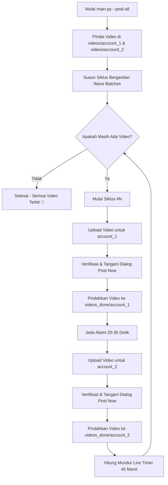

# 🎬 TikTok Studio Auto Poster Bot

[](https://www.python.org/)
[](https://playwright.dev/)
[](https://opensource.org/licenses/MIT)
[]()

> **Bot Otomatisasi Posting Video TikTok Multi-Akun via TikTok Web Studio dengan Jadwal Siklus Bergantian (Wave Cycles), Caption Unik Bebas Duplikasi, Penanganan Pop-up Otomatis, dan Anti-Bot Stealth.**

---

## 🌟 Fitur Utama

- 🔄 **Multi-Account Wave Cycles (Siklus Bergantian):**
  Mengunggah 1 video untuk Akun 1, jeda sejenak (20-35 detik), lalu 1 video untuk Akun 2, diikuti jeda interval terjadwal (misal **45 Menit**) sebelum memulai siklus berikutnya. Pola ini sangat natural dan aman dari deteksi spam platform.
- 🛡️ **Playwright Stealth & Real Chrome Channel:**
  Menggunakan Google Chrome sistem dan patch stealth anti-deteksi otomatis, meminimalkan resiko *shadowban* atau pemblokiran bot.
- 🔐 **Human-Assisted Interactive Login:**
  Mendukung login langsung via Scan QR Code, Email, Nomor Telepon, atau Google/Apple OAuth di jendela Chrome visual. Cookies sesi otomatis diekstrak dan disimpan rapi ke folder `cookies/`.
- ✍️ **Anti-Bug Caption Editor (Draft.js DOM Handling):**
  Menggunakan eksekusi reset DOM level native sehingga tombol *Backspace* tidak pernah memicu navigasi mundur browser (*discard changes bug*).
- 🧠 **Dynamic & 100% Unique Captions (SHA-256 Deduplication):**
  Menyediakan template caption modular dengan berbagai tema (General FYP, Tech/Coding, Web3/Crypto, Affiliate/Review) yang dilengkapi hash deduplikasi persisten agar tidak ada caption yang kembar.
- 🎯 **Smart Dialog & Popup Auto-Dismiss:**
  Mendeteksi dan menutup secara otomatis pop-up konfirmasi TikTok Studio seperti *"Continue to post? [Post now]"*, *"Turn on automatic content checks"*, serta tooltip panduan *"Got it"*.
- 📸 **Automatic Proof & Error Screenshots:**
  Secara otomatis menyimpan tangkapan layar bukti sukses terbit (`Video published`) atau tangkapan layar saat terjadi kendala ke folder `results/screenshots/`.
- 📦 **Auto-Archive Completed Videos:**
  Video yang sukses dipublikasikan otomatis dipindahkan dari folder antrean `videos/` ke folder arsip `videos_done/` agar antrean tetap teratur.
- ⏱️ **Live Terminal Progress Bar & Countdown:**
  Menampilkan jam target dan sisa waktu hitung mundur yang estetis di terminal selama jeda antar siklus.

---

## 📁 Struktur Direktori

```text
tiktok-auto-poster/
├── config.py                 # Konfigurasi pusat & pembacaan environment
├── login_helper.py           # Manajemen sesi & login interaktif multi-akun
├── tiktok_uploader.py        # Mesin inti upload & publish video TikTok Studio
├── caption_generator.py      # Generator caption modular & SHA-256 deduplikasi
├── queue_manager.py          # Pemindai folder video & pengatur antrean siklus
├── main.py                   # CLI Orchestrator utama (menu & argumen runner)
├── requirements.txt          # Daftar dependensi library Python
├── accounts.example.json     # Contoh konfigurasi akun (template dummy)
├── .env.example              # Contoh variabel lingkungan (.env)
├── .gitignore                # Proteksi file sensitif (cookies, video, logs)
├── README.md                 # Dokumentasi panduan lengkap
├── videos/                   # Folder penampung video antrean
│   ├── account_1/            # Taruh video untuk akun 1 di sini (.mp4)
│   └── account_2/            # Taruh video untuk akun 2 di sini (.mp4)
├── videos_done/              # Arsip otomatis video yang sudah sukses dipost
├── cookies/                  # Folder penyimpanan cookie sesi (*.json)
└── results/
    ├── screenshots/          # Bukti tangkapan layar hasil posting
    ├── post_history.json     # Catatan riwayat seluruh video yang telah dipost
    └── used_captions.json    # Catatan hash caption yang telah digunakan
```

---

## 🚀 Panduan Instalasi & Persiapan

### 1. Clone Repositori
```bash
git clone https://github.com/username/tiktok-auto-poster.git
cd tiktok-auto-poster
```

### 2. Buat Virtual Environment (Direkomendasikan)
```bash
# Windows
python -m venv venv
venv\Scripts\activate

# Linux / macOS
python3 -m venv venv
source venv/bin/activate
```

### 3. Instal Dependensi
```bash
pip install -r requirements.txt
playwright install chromium
```

> **Catatan:** Bot secara default menggunakan Google Chrome resmi yang terinstal di komputer Anda (`BROWSER_CHANNEL = "chrome"`). Pastikan Google Chrome sudah terpasang.

### 4. Konfigurasi Awal
Salin file konfigurasi contoh:
```bash
cp accounts.example.json accounts.json
cp .env.example .env
```

---

## 🔐 Langkah 1: Login Akun TikTok

Sistem menggunakan metode **Login Interaktif Human-Assisted** agar Anda dapat login dengan aman dan menyelesaikan captcha secara manual.

Jalankan perintah login untuk akun pertama:
```bash
python login_helper.py --login account_1
```
1. Browser Chrome akan terbuka otomatis menuju halaman login TikTok.
2. Silakan login menggunakan metode pilihan Anda (Direkomendasikan: **Scan QR Code** dari aplikasi TikTok di HP Anda karena paling cepat dan bebas captcha).
3. Setelah login berhasil, bot akan secara otomatis mendeteksi sesi, memvalidasi akses ke TikTok Studio, dan menyimpan cookies ke `cookies/account_1.json`.
4. Lakukan hal yang sama untuk akun kedua:
   ```bash
   python login_helper.py --login account_2
   ```

Cek status sesi seluruh akun kapan saja:
```bash
python login_helper.py --list
```
Untuk menguji keaktifan cookie akun tertentu secara headless:
```bash
python login_helper.py --verify account_1
```

---

## 📹 Langkah 2: Menyiapkan Video

Masukkan file video Anda (`.mp4`, `.mov`, `.webm`) ke dalam folder akun masing-masing:
- Masukkan video Akun 1 ke: `videos/account_1/`
- Masukkan video Akun 2 ke: `videos/account_2/`

Cek antrean video yang terdeteksi oleh sistem:
```bash
python main.py --status
```

---

## 🎯 Langkah 3: Menjalankan Bot Posting

### 1. Menjalankan Semua Siklus Posting (Mode Terjadwal Penuh)
Pola kerja: Upload Akun 1 ➔ Jeda ~30 detik ➔ Upload Akun 2 ➔ **Jeda 45 Menit** ➔ Lanjut Siklus berikutnya sampai seluruh video habis:
```bash
python main.py --post-all
```

Jika ingin berjalan di background tanpa membuka jendela browser visual:
```bash
python main.py --post-all --headless
```

Mengubah interval jeda antar siklus (misalnya 30 menit):
```bash
python main.py --post-all --interval 30
```

### 2. Mode Posting Satu Video Langsung (Single Post)
Jika Anda hanya ingin memposting 1 video spesifik untuk akun tertentu tanpa antrean siklus:
```bash
python main.py --single --account account_1 --video "videos/account_1/video_sample.mp4"
```
Dengan custom caption:
```bash
python main.py --single --account account_1 --video "videos/account_1/sample.mp4" --caption "Halo dunia! Ini video pertama saya #fyp #viral"
```

---

## ✍️ Kustomisasi Caption & Tema

Bot dilengkapi generator caption otomatis dengan deduplikasi hash SHA-256 di `caption_generator.py`.

Tema bawaan yang tersedia:
- `general`: Trik viral, motivasi, edukasi umum, & tips hidup.
- `tech`: Tips koding, productivity tools, AI software shortcuts.
- `crypto`: Analisa tren Web3, token updates, edukasi pasar (menggunakan placeholder `$DEMO`).
- `affiliate`: Review produk, rekomendasi barang unik, racun TikTok Shop.

Anda dapat mengubah tema default di file `.env` atau `config.py`:
```env
CAPTION_THEME=tech
TOKEN_OR_PRODUCT_NAME=$MYTOKEN
CONTRACT_ADDRESS_OR_LINK=https://example.com/product
```

Uji coba hasil generator caption di terminal:
```bash
python caption_generator.py --theme tech --count 3
```

---

## ⚙️ Ringkasan Konfigurasi (`config.py`)

| Parameter | Default | Keterangan |
| :--- | :--- | :--- |
| `DEFAULT_INTERVAL_MINUTES` | `45` | Waktu jeda (menit) setelah Akun 1 & 2 selesai upload sebelum siklus berikutnya |
| `HEADLESS` | `False` | Jalankan browser visual (`False`) atau di background (`True`) |
| `BROWSER_CHANNEL` | `"chrome"` | Menggunakan Google Chrome sistem (fallback ke chromium) |
| `DEFAULT_VISIBILITY` | `"Public"` | Privasi default video: `Public`, `Friends`, atau `Private` |
| `MOVE_AFTER_POST` | `True` | Otomatis pindahkan video yang berhasil dipost ke `videos_done/` |
| `UPLOAD_TIMEOUT` | `300` | Batas waktu tunggu proses upload file (detik) |
| `INTER_ACCOUNT_DELAY` | `(20, 35)` | Rentang jeda acak (detik) antar akun dalam 1 siklus |

---

## 🔄 Alur Kerja Siklus Posting (Wave Cycle Workflow)



---

## ❓ FAQ & Penyelesaian Kendala (Troubleshooting)

### 1. Pesan error: "Sesi login kedaluwarsa"?
- Cookies sesi TikTok memiliki masa aktif tertentu (biasanya beberapa hari hingga minggu).
- Solusi: Cukup jalankan ulang perintah login interaktif:
  ```bash
  python login_helper.py --login account_1
  ```

### 2. Mengapa muncul modal *"Continue to post? We're still checking your video..."*?
- TikTok Studio sering melakukan pemeriksaan hak cipta musik (*Music Copyright Check*) yang membutuhkan waktu beberapa detik setelah upload.
- **Bot sudah dilengkapi penanganan otomatis:** Bot akan langsung mengklik tombol konfirmasi **"Post now"** tanpa membatalkan proses upload.

### 3. Mengapa status video baru menunjukkan *"Content under review"* dan *"Only me"*?
- Hal ini adalah sistem standar keamanan konten TikTok. Video baru akan direview oleh algoritma TikTok selama 1-3 menit pertama sebelum otomatis berubah status menjadi publik (*Everyone*) untuk seluruh penonton.

### 4. Apakah aman memposting 2 akun dari satu IP?
- Ya, berkat pola **Wave Cycles** (Akun 1 posting ➔ jeda ➔ Akun 2 posting ➔ jeda 45 menit), ritme postingan terlihat wajar seperti aktivitas manusia asli dan tidak memicu deteksi spam kecepatan tinggi.

---

## 🔒 Keamanan & Kebijakan Privasi

- **JANGAN PERNAH MENGUNGGAH / PUSH FOLDER `cookies/` ATAU FILE `accounts.json` KE GITHUB!**
- Repositori ini sudah dilengkapi `.gitignore` yang secara otomatis mengabaikan file `.json` di folder `cookies/`, file video asli di folder `videos/`, serta log dan screenshot hasil.
- Selalu periksa status git Anda sebelum melakukan commit:
  ```bash
  git status
  ```

---

## 📜 Lisensi

Proyek ini dilisensikan di bawah lisensi [MIT](LICENSE). Bebas digunakan, dimodifikasi, dan didistribusikan untuk keperluan pribadi maupun komersial.
